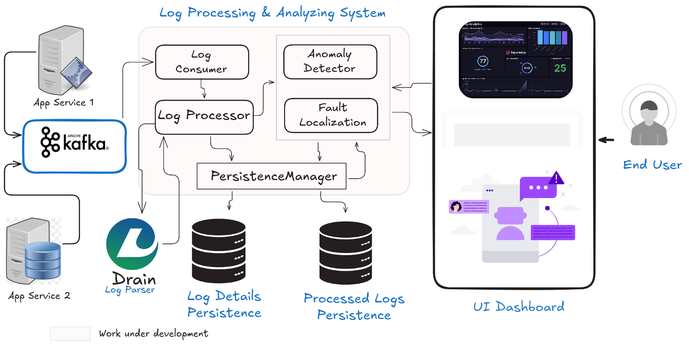

# sysCrow

sysCrow is an autonomous, log-based anomaly detection and fault localization system inspired by peer‑reviewed research. It combines supervised deep learning for anomaly detection with unsupervised segmentation for log-based fault localization (LBFL).

## Architecture

## Algorithms

sysCrow relies on two complementary approaches:

### 1) Supervised anomaly detection (DeepLog‑inspired)

A sequence‑modeling approach that learns normal log patterns and flags deviations as anomalies.

### 2) Log‑Based Fault Localization using unsupervised segmentation (LBFL)

An unsupervised method that segments logs into meaningful contexts to highlight suspicious components and events related to faults.

## References

1. Min Du, Feifei Li, Guineng Zheng, and Vivek Srikumar. 2017. DeepLog: Anomaly Detection and Diagnosis from System Logs through Deep Learning. In Proceedings of the 2017 ACM SIGSAC Conference on Computer and Communications Security (CCS '17), 1285–1298. https://doi.org/10.1145/3133956.3134015

2. Dobrowolski, W.; Iwach-Kowalski, K.; Nikodem, M.; Unold, O. 2024. Log-Based Fault Localization with Unsupervised Log Segmentation. Applied Sciences, 14, 8421. https://doi.org/10.3390/app14188421

We gratefully acknowledge these works; we adapted ideas from them to build a practical system.

## Acknowledgments

This project was developed by me and my friend, [Prasiddha Acharya](https://github.com/prsydha), as part of our minor project for the Software Engineering degree program at [NCIT](https://ncit.edu.np) ([Pokhara University](https://pu.edu.np)).
